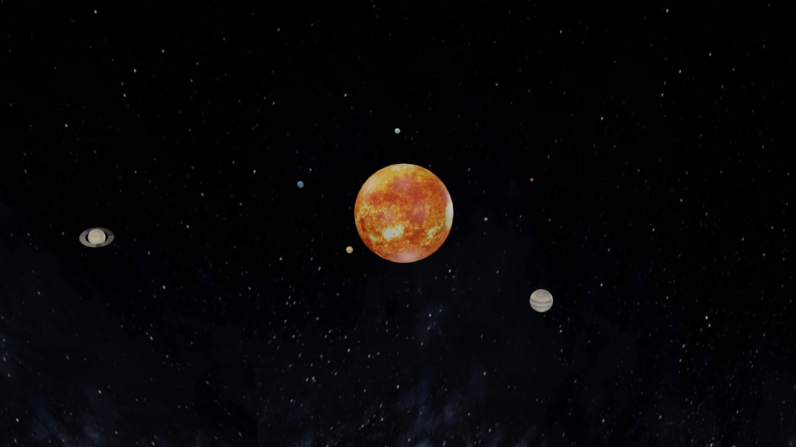

# Solar System

This is an animated solar system model implemented in Blender for the University of Rome 3 Computer Graphics course.

## Screenshot

## Features

- Textures
- Lighting
- Fixed camera
- Sun, seven planets and moon
- Orbit simulation

## Texture

Textures are taken from [solarsystemscope.com](https://www.solarsystemscope.com/textures/).

## Data

The solar system is not in scale because, when attempting to display it at its true scale, it becomes difficult to show all the planets in a single view. 

The vastness of space makes it impossible to accurately depict the distances between the planets in a single image or animation. 

To give a sense of the relative size and distances in the solar system, it been used a reduced, approximated scale, which can make the planets appear closer together than they actually are. 

In this way, it is possible to view the entire solar system in a single scene, but it is important to note that the scale is not accurate.

You can get an impression of the actual scale of solar system at [If the Moon Were Only 1 Pixel](http://joshworth.com/dev/pixelspace/pixelspace_solarsystem.html).
